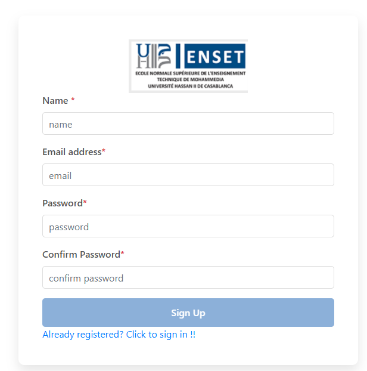
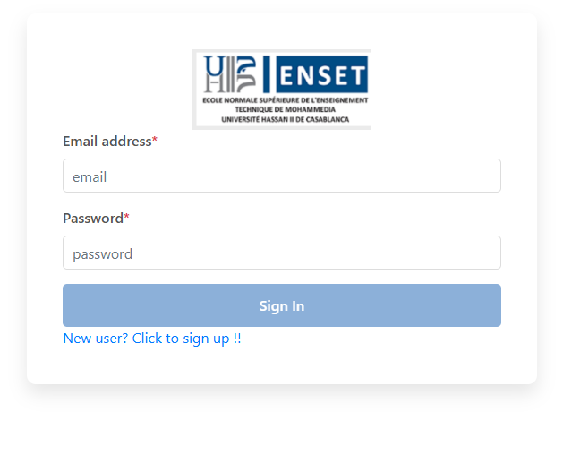
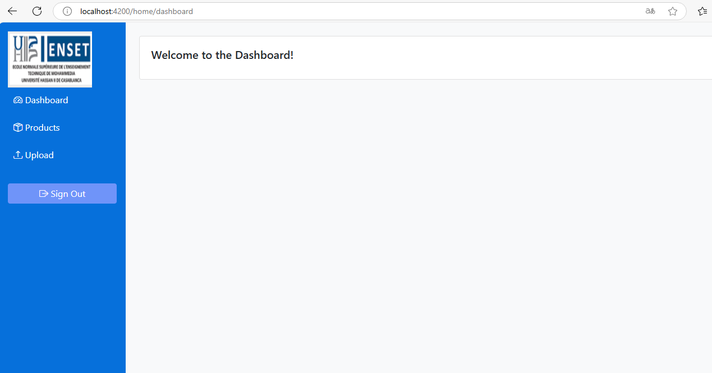
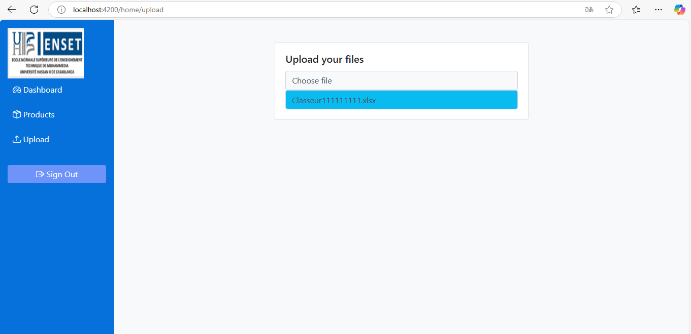

# Authentication App with Angular and JSON Server

## Overview
This project is a simple authentication system built using Angular for the frontend and JSON Server to simulate a backend API. It includes user authentication features such as:
- Signup (Registration)
- Login
- Logout
- Access control for protected pages

## Features
- User registration with JSON Server as a mock database
- Authentication using local storage
- Redirecting unauthorized users to the login page
- A basic home page after successful authentication
- Logout functionality

## Screenshots

### 1. Signup Page  


### 2. Login Page  


### 3. Protected Home Page  


### 4. Uplad file page 


## Technologies Used
- **Frontend:** Angular
- **Backend (Mock API):** JSON Server

## Installation

### Prerequisites
Ensure you have the following installed:
- [Node.js](https://nodejs.org/) (LTS version recommended)
- [Angular CLI](https://angular.io/cli)

### Setup
1. Clone this repository:
   ```sh
   git clone <repository-url>
   cd <repository-folder>
   ```

2. Install dependencies:
   ```sh
   npm install
   ```

3. Start JSON Server:
   ```sh
   json-server --watch db.json --port 3000
   ```
   This will start a mock API on `http://localhost:3000`.

4. Start the Angular application:
   ```sh
   ng serve
   ```
   The app will be available at `http://localhost:4200/`.

## Usage
1. **Signup:** Create a new user account.
2. **Login:** Authenticate using the registered credentials.
3. **Protected Pages:** Users must log in to access protected routes.
4. **Logout:** End the session and restrict access to protected pages.


## API Endpoints (JSON Server)
- **GET /users** - Retrieve users
- **POST /users** - Register a new user


## License
This project is open-source and free to use.


